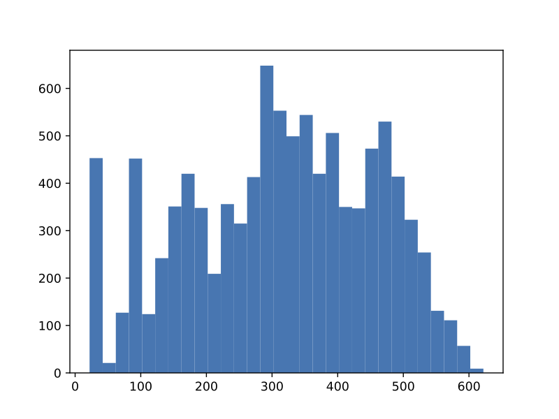

# Microworld A
## Results
### Approach 1
#### Method
1. Keep a path in memory
2. Check percepts for the `r` tile
3. If the `r` tile is found, overwrite the current path with the path to the `r` tile
4. Otherwise, update memory with new information from percepts
5. If the path is empty, run breadth-first traversal until a tile with unknown neighbors is found and set that as the new path
6. Follow the path

#### Results
From running 10,000 instances of the simulation on map C, the following data were collected:
| Statistic     | Approach 1    |
| ------------- | ------------- |
| Minimum turns | 22            |
| Q1 turns      | 198           |
| Median turns  | 320           |
| Q3 turns      | 430           |
| Maximum turns | 622           |
| Mean turns    | 312.13        |

Above: Histogram of completion times (in turns)